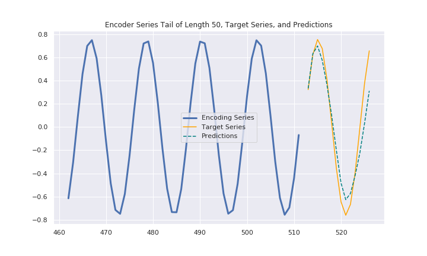
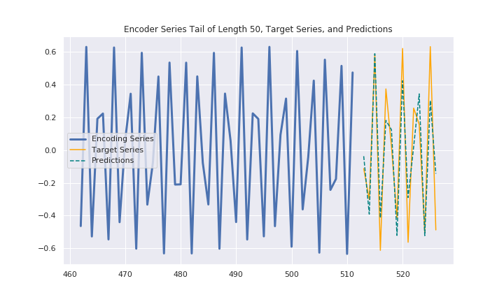

# SineWaveForecastingWithConv
Demonstrating simple sine wave forecast with dilated causal convolutional newral network on jupyter notebook.

The model is based on [Time Series Forecasting with Convolutional Neural Networks - a Look at WaveNet]( https://jeddy92.github.io/JEddy92.github.io/ts_seq2seq_conv/ ) which is a best reading ever and I learned a lot from the post. However the data preparation is not very simple for beginners. Here I made simple version to help understand the basics.

## Getting Started

1. run sine_wave_gen.ipynb to generate data file
2. run simple_wave.ipynb to train and predict

## Prerequisites

* keras
* pandas
* seaborn

## What is Forecast

* forecast 1

* forecast 2

